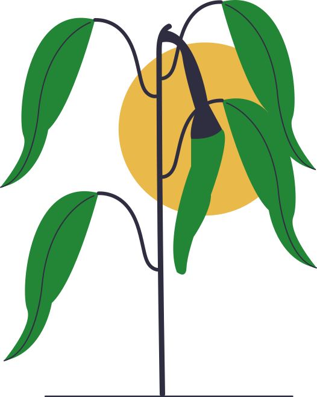
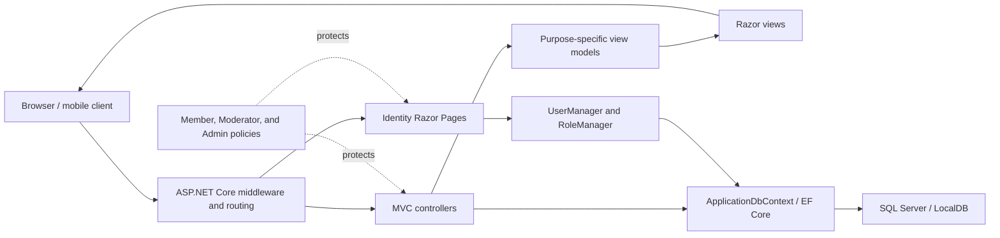
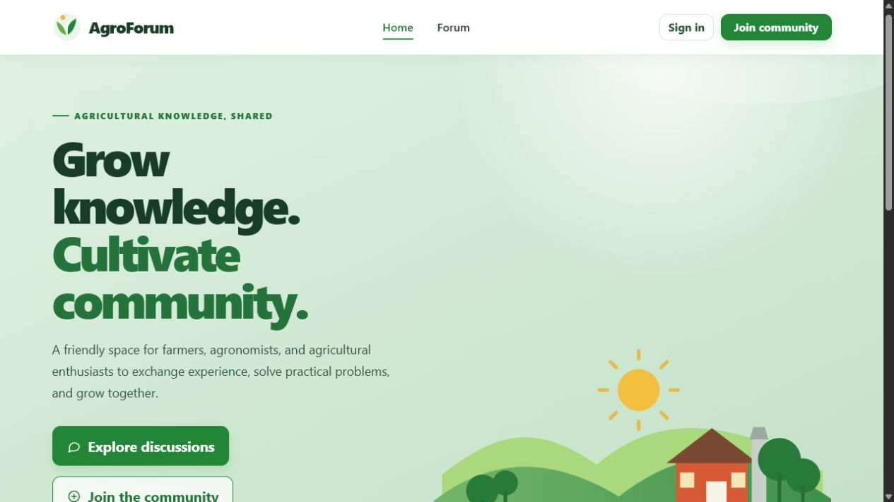
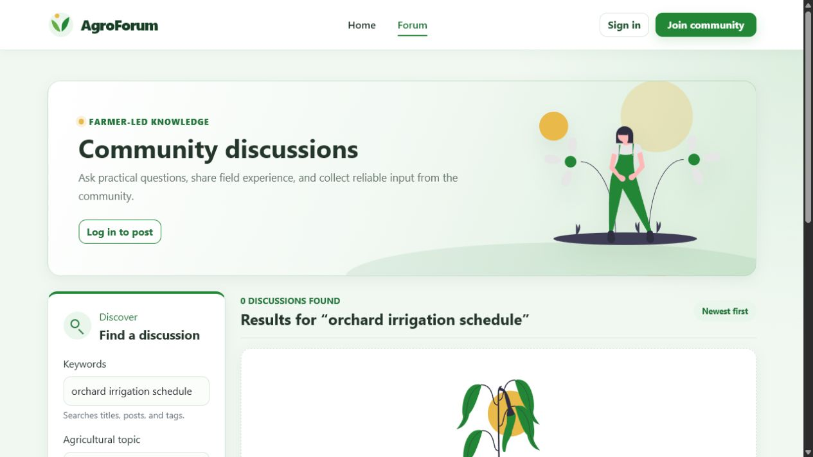
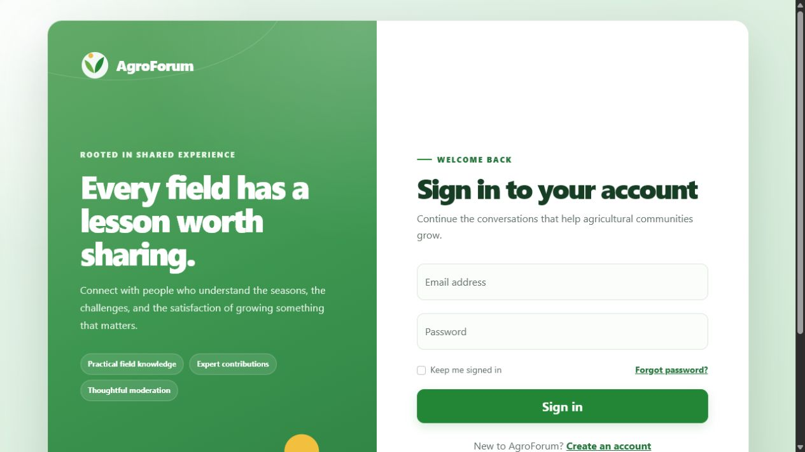

# AgroForum

> A secure, farmer-focused community platform for sharing practical agricultural knowledge, asking questions, and building a trustworthy record of field experience.

<p align="center">
  
</p>


AgroForum is a thesis project developed as an ASP.NET Core MVC web application. Its purpose is to give farmers, agricultural professionals, and people interested in farming one organized place to exchange experience, solve practical problems, and preserve useful knowledge for the wider community.

The project combines a public discussion forum with role-based moderation, administration tools, content discovery, and a responsive visual identity inspired by agriculture.

## Project vision

Agricultural knowledge is often practical, local, and gained through experience. It can easily remain scattered across private conversations or disappear before it helps the next person facing the same problem.

AgroForum aims to turn those individual experiences into a searchable and responsibly managed community resource. The finished platform should:

- Make it easy to ask clear agricultural questions and receive useful answers.
- Help visitors discover relevant discussions by keyword, topic, and community activity.
- Encourage knowledge sharing without excluding users who prefer to post anonymously.
- Give moderators transparent, reversible tools for keeping discussions safe and useful.
- Give administrators oversight of roles, reports, removed content, and moderation activity.
- Remain approachable on desktop and mobile, including for users with limited technical experience.
- Grow from a working forum into a dependable agricultural knowledge network.

## What has been achieved

### Community forum

- Public discussion browsing and detailed discussion pages.
- Account registration and secure sign-in through ASP.NET Core Identity.
- Authenticated post creation, commenting, and content reporting.
- Optional anonymous posting while retaining accountable ownership internally.
- One optional JPEG, PNG, or WebP image per discussion with server-side validation and responsive presentation.
- Topic tags for organizing agricultural conversations.
- Pinned and locked discussion states.
- Comment, like, and favorite activity counters.

### Forum discovery

- Keyword search across discussion titles, content, and tags.
- Topic filtering with removable active-filter indicators.
- Sorting by newest, most liked, or most discussed.
- Six-result pagination that preserves the active search, topic, and sorting choices.
- Accurate result totals and clear zero-result feedback.
- Pinned discussions remain prioritized in every sorting mode.

### Community engagement

- Authenticated members can like or unlike discussions from the forum feed and full discussion pages.
- Members can save or remove discussions with clear active states and updated community counts.
- A private Saved discussions page collects each member's useful posts in save-date order.
- Signed-out visitors receive clear participation prompts and return to the same discussion after signing in.
- Engagement actions use anti-forgery protection, validate active posts, and keep redirects inside AgroForum.

### Moderation and administration

- Separate role-protected Moderator and Admin workspaces.
- A report workflow with `Open`, `InReview`, `Resolved`, and `Dismissed` states.
- Ticket claiming, releasing, reassignment, reopening, filtering, and documented decisions.
- Post and comment soft deletion, allowing Admin restoration when necessary.
- Discussion locking and tag management for moderation.
- Admin-only discussion pinning and moderator-role management.
- Append-only moderation auditing and moderator activity metrics.
- Concurrency protection for report processing.

### User experience and visual design

- A responsive agricultural design system using leaf green, botanical green, soft sage, and white surfaces.
- A database-driven homepage with recent discussions, popular topics, and community totals.
- Redesigned Login and Register pages with a responsive split-layout experience.
- Consistent styling across the forum, forms, moderation board, and administration board.
- Agricultural illustrations integrated into the forum without overwhelming its functional layout.
- Improved empty states, feedback messages, status badges, and mobile layouts.

## Development roadmap

| Milestone | Main objective | Status |
| --- | --- | --- |
| Foundation | MVC structure, Identity, database, posts, comments, tags, and reports | Complete |
| Version 2 | Admin and Moderator boards, ticket workflow, reversible controls, and audit history | Complete |
| Design refresh | Agricultural visual system, live homepage, and redesigned authentication | Complete |
| Version 3 | Search, topic filters, sorting, pagination, result metrics, and stronger farming identity | Complete |
| Community engagement | Interactive likes and favorites, saved discussions, and clearer participation feedback | Complete |
| Anonymous posts and images | Accountable anonymous posting plus one validated, responsive image per discussion | Complete |
| Abuse prevention | reCAPTCHA v3 on registration, posts, comments, and reports with server-side score validation | Next milestone |
| Community identity | User profiles, activity history, reputation or contribution badges, and notifications | Planned |
| Knowledge quality | Accepted solutions, richer agricultural resources, and improved topic organization | Planned |
| Final thesis release | Automated testing, accessibility and security review, performance work, deployment, and evaluation | Target outcome |

The roadmap describes the intended development direction. Planned features will be implemented and evaluated incrementally rather than presented as already available.

## The finished goal

The final objective is not simply to produce a forum that can create posts. It is to deliver and evaluate a complete community system in which:

1. A visitor can quickly discover reliable agricultural discussions.
2. A registered member can ask, answer, organize, save, and follow useful topics.
3. Community activity makes valuable contributions easier to identify.
4. Moderators can handle reports consistently without permanently destroying content by default.
5. Administrators can manage trust, roles, restoration, and accountability from one controlled workspace.
6. The platform is responsive, accessible, tested, documented, and ready for a realistic deployment demonstration.

Success will be measured through functional correctness, usability, responsible moderation, security, maintainability, and the platform's ability to support meaningful agricultural knowledge exchange.

## Technology stack

| Area | Technology |
| --- | --- |
| Application | ASP.NET Core MVC on .NET 8 |
| User interface | Razor Views, Bootstrap, custom CSS, and JavaScript |
| Authentication | ASP.NET Core Identity |
| Authorization | Role-based access for Members, Moderators, and Admins |
| Data access | Entity Framework Core 8 |
| Database | SQL Server / SQL Server LocalDB |
| Data evolution | Entity Framework Core migrations |
| Version control | Git and GitHub feature-branch workflow |

## Architecture

AgroForum follows the ASP.NET Core MVC pattern and keeps persistence, presentation, authentication, and role authorization separated through the framework's standard layers.



### Request flow

1. ASP.NET Core routing receives a request and selects an MVC action or Identity Razor Page.
2. Authentication and role authorization are applied before protected actions are executed.
3. Controllers use Entity Framework Core and Identity services to query or update the application state.
4. Controllers map database entities into focused view models instead of exposing persistence models directly to the UI.
5. Razor Views render the result using the shared responsive layout and agricultural design system.

The main domain areas are forum content, users and roles, reports, and moderation auditing. SQL Server stores their relationships, while EF Core migrations keep the schema aligned with each milestone.

## Application areas

| Area | Local endpoint | Access |
| --- | --- | --- |
| Homepage | `/` | Public |
| Forum | `/Forum` | Public browsing; account required to participate |
| Register | `/Identity/Account/Register` | Public |
| Sign in | `/Identity/Account/Login` | Public |
| Moderation board | `/Moderation` | Moderator or Admin |
| Administration board | `/Admin` | Admin only |

## Screenshots

### Homepage

The public landing page introduces the community, highlights agricultural topics, and displays live discussion and membership information.



### Forum discovery

The Version 3 forum experience combines the new farming identity with keyword search, topic filters, sorting, result totals, and clear empty-state feedback.



### Sign-in experience

The custom Identity interface preserves the underlying ASP.NET Core security flow while presenting a clearer, responsive agricultural design.



## Getting started

### Prerequisites

- [.NET 8 SDK](https://dotnet.microsoft.com/download/dotnet/8.0)
- SQL Server LocalDB on Windows, or another reachable SQL Server instance
- The `dotnet-ef` tool when migrations need to be managed

### Run locally

```powershell
git clone https://github.com/vasilisvar/AgroForum.git
cd AgroForum
dotnet restore
dotnet ef database update --project AgroForum/AgroForum.csproj --startup-project AgroForum/AgroForum.csproj
dotnet run --project AgroForum/AgroForum.csproj
```

The standard development profiles use:

- `https://localhost:7053`
- `http://localhost:5172`

If a different SQL Server instance is used, replace `ConnectionStrings:DefaultConnection` through user secrets, environment configuration, or a deployment-specific settings file.

## Creating the first Admin safely

AgroForum contains no default Admin or Moderator password. This is intentional: credentials must never be committed to the repository.

1. Start the application and register the intended Admin account normally.
2. Store that account's email in user secrets:

```powershell
dotnet user-secrets set "BootstrapAdmin:Email" "admin@example.com" --project AgroForum/AgroForum.csproj
```

3. Restart the application.
4. Sign in and open `/Admin`.

During startup, the configured existing account receives the `Admin` role. Keep `BootstrapAdmin:Email` empty in committed configuration. In a deployed environment, the equivalent environment variable is `BootstrapAdmin__Email`.

An Admin can grant or revoke the Moderator role from the Admin board. Moderators can then access `/Moderation` using their own accounts; no shared credentials are required.

## Database migrations

Apply all migrations before running a fresh checkout:

```powershell
dotnet ef database update --project AgroForum/AgroForum.csproj --startup-project AgroForum/AgroForum.csproj
```

The Version 2 migration preserves earlier report records by mapping legacy statuses as follows:

| Previous status | Current status |
| --- | --- |
| `Pending` | `Open` |
| `Accepted` | `Resolved` |
| `Rejected` | `Dismissed` |

## Repository structure

```text
AgroForum/
├── AgroForum.sln
├── README.md
├── CHANGELOG.md
└── AgroForum/
    ├── Areas/Identity/       Custom account pages
    ├── Constants/            Role names and shared constants
    ├── Controllers/          Forum, Home, Moderation, and Admin flows
    ├── Data/                 EF Core context and migrations
    ├── Models/               Domain and persistence models
    ├── ViewModels/           Purpose-specific UI models
    ├── Views/                Razor views and shared layout
    └── wwwroot/              CSS, JavaScript, libraries, and illustrations
```

## Security and moderation principles

- Password storage and sign-in behavior are handled by ASP.NET Core Identity.
- Admin and Moderator routes are protected by server-side role authorization.
- Reports require authenticated users and validated targets.
- Removed content is soft-deleted and records who removed it and why.
- Moderation decisions are recorded in an append-only audit trail.
- Report row versions help prevent conflicting moderation decisions.
- Bootstrap identities are configured outside source control.

## Version history

Detailed milestone notes are maintained in [CHANGELOG.md](CHANGELOG.md). Version `2.0.0` is tagged for the Admin and Moderator board release, Version 3 contains the completed forum-discovery work, and community engagement is merged into `main`. Day 8 anonymous-post and image work is developed on its own feature branch before review and merge.

## Project status

AgroForum is under active development as a thesis project. The existing application demonstrates the complete forum foundation, secure identity flow, role-based moderation architecture, agricultural interface, forum discovery, community engagement, accountable anonymous posting, and validated discussion images. The next scheduled milestone is reCAPTCHA v3 abuse prevention, followed by community identity, knowledge quality, testing, deployment readiness, and formal evaluation.
